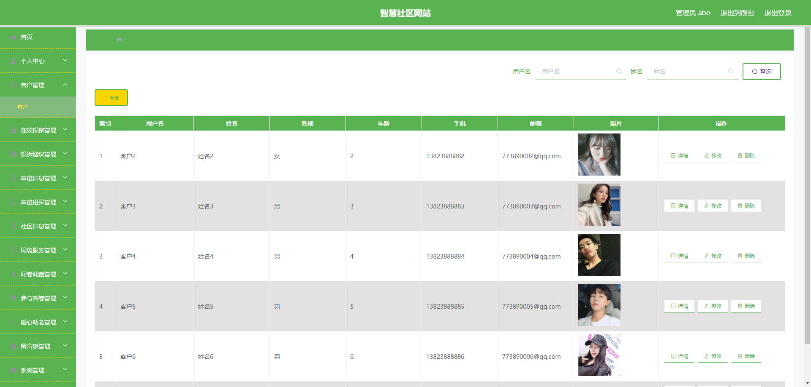

# 基于Springboot的智慧社区

## Springboot-0076


## 技术栈

Springboot mybatisplus vue mysql maven


## 数据库表(20张)


## 功能介绍

```properties
本基于web的智慧社区设计与实现有管理员和客户两个角色。

客户功能有车位信息，社区信息，周边服务，问卷调查，爱心助老，通知公告，留言反馈，个人中心，客服中心，在线报修管理，投诉建议管理，车位租买管理，社区信息管理，参与答卷管理，我的收藏管理。

管理员功能有个人中心，客户管理，在线报修管理，投诉建议管理，车位信息管理，车位租买管理，社区信息管理，周边服务管理，问卷调查管理，参与答卷管理，爱心助老管理，留言板管理，系统管理。
```


## 图片

### 前台


### 后台





## 访问路径

### 前台

```properties
http://localhost:8080/springboot224bf/front/pages/login/login.html

账号 001
密码 001
```

### 后台

```properties
http://localhost:8080/springboot224bf/admin/dist/index.html#/login

账号 abo
密码 abo
```


## 功能图


## 文档目录


## 打赏或交流


